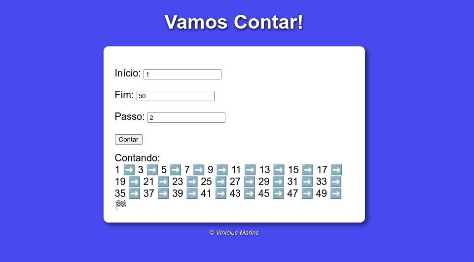
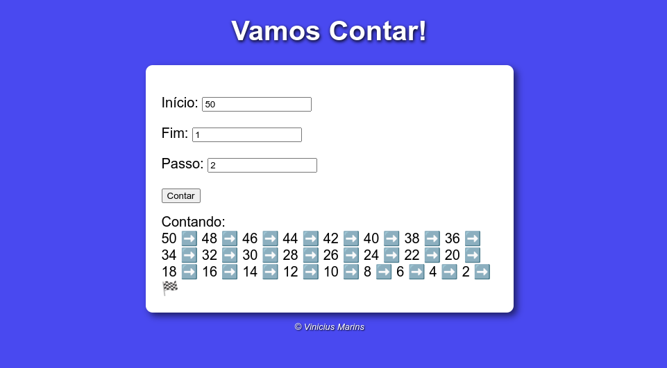
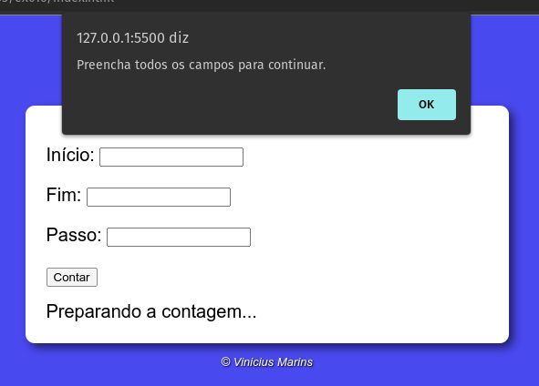
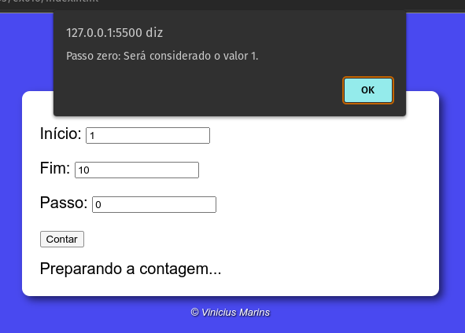

# Contador com intervalos
> Página web feita com o objetivo de exercitar repetições com Javascript. É possível contar de forma crescente e decrescente com intervalos.

## :computer: Tecnologias utilizadas
 * HTML
 * CSS
 * Javascript

## :mag: Informações do aplicativo

O aplicativo possui três áreas de inserção de números, onde é possível indicar um valor inicial, um valor final e um passo, que é 
exatamente o valor do intervalo da contagem.

Também é possível fazer a contagem de forma decrescente.

Também é feita a verificação e validação dos campos antes de enviar as informações. Caso os campos não estejam preenchidos é enviada uma mensagem de erro
ao usuário.

Se o valor inicial e final forém o mesmo, é solicitado ao usuário que coloque valores diferentes.

Se o usuário definir o intervalo como zero, o aplicativo considera o intervalo como 1 e faz a contagem.

